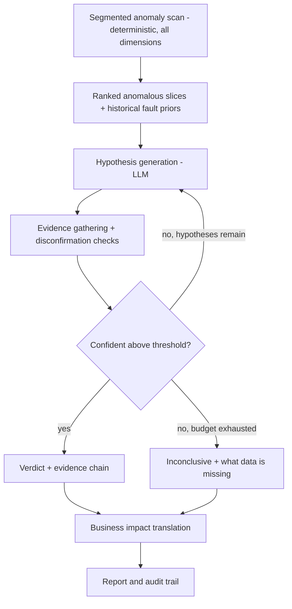

# RootLens — Architecture (v2)

## 1. Problem & Approach

Payment failures on any given day have many possible root causes: an issuer bank outage, a card network degrading, a risk rule change silently rejecting high-ticket transactions, a broken checkout step, a retry storm, or a settlement delay. Today, diagnosing "why did success rate drop at 2pm" is manual: an ops analyst pulls dashboards, slices by dimension, and guesses.

RootLens is an agent that automates this diagnosis. It is built around one rule: **the LLM never invents numbers.** All evidence comes from deterministic tools (SQL queries over transaction data); the LLM's job is to decide which tool to call next, interpret results, and explain *why* a specific detected anomaly happened — with every claim traceable back to a query.

To prove this isn't "a ChatGPT wrapper," RootLens ships with a synthetic data engine that injects faults with known ground truth, and an eval harness that measures diagnosis accuracy against that ground truth — honestly, including failure cases.

## 2. Design Principles

1. **Evidence before hypotheses.** Anomaly detection is deterministic and multi-dimensional (segmented, not a single aggregate metric). The LLM explains a specific, already-detected signal — it does not free-associate a list of "common causes" from training data.
2. **Falsification, not just confirmation.** For every hypothesis, the agent must also state what evidence would disprove it, and check that.
3. **Grounded priors.** Historical fault-rate frequencies are given to the LLM as structured context, not left to its internal assumptions.
4. **Full audit trail.** Every tool call (query, parameters, result, timestamp) is logged. Every claim in a report links to the call that produced it.
5. **Honest uncertainty.** If evidence is inconclusive after the hypothesis budget is exhausted, the agent returns "inconclusive — need X" rather than guessing.
6. **No PII/PAN in LLM context.** Tools only ever return aggregated or categorical fields (issuer BIN, network, bucketed amount, region) — never raw card numbers.
7. **Model-agnostic harness.** The tool execution, evidence store, and eval scoring are fully decoupled from which LLM is doing the reasoning (BYOK-ready), which turns the eval harness into a cross-model diagnosis-accuracy leaderboard, not just a single-model demo.

## 3. Pipeline



## 4. Components

### 4.1 Synthetic Data Engine

Generates a transactions dataset with **known ground truth injected**, so diagnosis accuracy is measurable.

**`transactions` table (DuckDB):** txn_id, ts, amount, currency, payment_method (card/upi/netbanking), card_network (visa/mastercard/rupay/amex, card only), issuer_bank, status (success/failed/pending), failure_code, gateway_latency_ms, merchant_id, geo_region.

**`fault_events` table (ground truth — never shown to the agent):** fault_id, fault_type, start_ts, end_ts, affected_scope (JSON), difficulty_tier.

**Fault types (v1, week 1 scope):**

| Fault | Signature injected | Ground truth label | Tier |
|---|---|---|---|
| Issuer bank outage | failure rate to ~90% for one issuer_bank, `failure_code=issuer_unavailable` | `bank_outage:<bank>` | clean |
| Card network degradation | failure rate to ~40-55% across all issuers on one card_network | `network_degradation:<network>` | clean |
| High-ticket decline rule | failure rate to ~60-80% for amount > threshold, after a rule-change timestamp | `rule_trigger:<threshold>` | clean |
| Compound (outage + rule) | bank outage and high-ticket rule overlapping in time | `compound:bank_outage+rule_trigger` | compound |

**Fault types (week 2 additions):** retry storm, checkout funnel break, settlement delay, plus a **red-herring** scenario (a benign correlated anomaly — e.g., a volume spike from a marketing campaign — co-occurring with a real fault, to test whether the agent conflates correlation with causation) and a **noisy** tier (faults with partial/ambiguous signal).

Each scenario produces a ground-truth JSON used only by the eval harness, never by the agent.

### 4.2 Diagnosis Engine

**Stage 1 — Segmented anomaly scan (deterministic, no LLM).** Compares a "current" window against a "baseline" window across every dimension (issuer_bank, card_network, payment_method, amount_bucket) and ranks slices by an impact score (`|success_rate_drop| × volume_share`). This is what a real analyst does first — slice until something jumps out — done automatically. Output: ranked list of anomalous segments with baseline rate, current rate, volume, and onset estimate.

**Stage 2 — Hypothesis generation (LLM).** Given the ranked anomalous segments and a historical fault-rate prior table, the LLM proposes ranked candidate causes that *explain the specific detected segment(s)* — not a generic brainstorm.

**Stage 3 — Evidence gathering + disconfirmation (LLM + tools).** For each hypothesis, the agent calls tools to both confirm and actively try to disprove it (e.g., "if network-wide, all issuers on that network should show elevated declines — check").

**Tool set exposed to the agent:**
- `query_transactions(filters, group_by, metrics)` — the only path to raw data; every call logged
- `timeseries(metric, granularity, window)` — onset alignment
- `compare_segments(dim_a, dim_b)` — concentrated vs. diffuse test
- `baseline_compare(metric, window)` — z-score vs. historical baseline

**Stage 4 — Verdict or inconclusive.** Ranked diagnosis with confidence and evidence citations, or an explicit "inconclusive — need X" if the hypothesis budget (max 8 tool-call rounds) is exhausted without a confident match.

**Guardrails:**
- Temperature 0 and full transcript logging for every eval run (reproducibility)
- Hard cap on tool-call rounds per diagnosis
- All SQL parameterized; the agent can only query, never mutate
- No raw PAN/CVV ever leaves the `transactions` table into LLM context

### 4.3 LLM Adapter (BYOK harness)

A single `LLMClient` interface (`generate(system, user) -> LLMResponse`) with thin implementations per provider (OpenAI, Anthropic first; extensible). The orchestration, tools, evidence store, and eval scoring never know which provider is behind the interface. This is intentionally minimal — no heavyweight agent framework — so the tool-calling loop and audit trail stay fully inspectable.

### 4.4 Evidence Store / Audit Trail

Every tool call and its result is logged (query, params, result, timestamp, scenario_id). The report UI shows an expandable "evidence chain" per claim, linking back to the exact query that produced it.

### 4.5 Report Layer

- **Verdict card** — root cause, confidence, evidence citations
- **Impact estimate** — GMV affected, transactions affected, duration
- **Business impact translation** — time-to-diagnosis (agent) vs. a documented manual-analyst baseline, converted into hours saved and ₹ GMV protected per hour of faster mitigation
- **Evidence trail UI** — expandable reasoning chain, full query log
- **Replay mode** — cached full transcripts for demo scenarios, so the live 5-minute video doesn't depend on a live API call succeeding; at least one genuinely live run is kept to prove it isn't canned
- **Export** — full diagnosis as JSON/markdown

## 5. Evaluation Harness

| Metric | How measured |
|---|---|
| Diagnosis accuracy, by difficulty tier (clean / compound / noisy) | % of scenarios where verdict matches injected fault type, reported per tier — not blended into one number |
| Precision of cited evidence | % of cited evidence items that are actually relevant (spot-check set) |
| Business impact | time-to-diagnosis vs. manual baseline → hours saved → ₹ GMV protected |
| False-positive rate | % of healthy periods flagged as anomalous |
| Inconclusive rate | % correctly flagged as "insufficient data" (should be low but non-zero, and honestly reported) |
| Model leaderboard | accuracy × latency × cost, per LLM provider, on the same scenario set |

Target: **>85% accuracy on clean scenarios**, honest (lower) numbers reported on compound/noisy tiers.

## 6. Tech Stack

| Layer | Choice | Why |
|---|---|---|
| Synthetic data gen | Python + NumPy + Faker, seeded | deterministic, reproducible |
| Data store | DuckDB (single engine) | analytical SQL + append-only audit log, zero ops, one file |
| LLM adapter | Thin custom `LLMClient` interface, OpenAI + Anthropic first | model-agnostic harness, BYOK-ready, no framework overhead |
| Agent orchestration | Hand-rolled tool-calling loop | full control and transparency for the audit trail |
| API layer | FastAPI (stretch, week 2+) | clean endpoints if time allows |
| Frontend | Streamlit (v1, shipped) | fastest path to a working evidence-chain UI within 3 weeks; Next.js deferred/cut |
| Eval harness | pytest + generated ground-truth JSON | measurable, repeatable |
| Tooling | `uv`, `ruff`, `pytest`, GitHub Actions CI | engineering hygiene signal |

## 7. Repo Structure

```
rootlens/
├── README.md
├── pyproject.toml
├── docs/
│   └── architecture.md
├── data_engine/          # synthetic generator + fault injector + scenarios
├── diagnosis/            # llm_client, anomaly_scan, tools, agent loop, evidence store, priors
├── eval/                 # harness + ground-truth scenarios
├── api/                  # FastAPI layer (stretch)
├── frontend/             # Streamlit app
├── scripts/              # exit-criterion proof scripts
└── tests/                # unit + eval tests
```

## 8. Build Plan (3 weeks)

**Week 1 — Foundation**
- Segmented anomaly scan (deterministic, multi-dimension)
- Fault injector: 4 scenarios (bank outage, network degradation, high-ticket rule, 1 compound)
- `LLMClient` adapter (OpenAI + Anthropic)
- Exit: agent diagnoses 2 clean fault types correctly in a proof script

**Week 2 — Agent + product surface**
- Full tool-calling loop with disconfirmation checks
- Evidence store / audit trail
- Remaining fault types (retry storm, checkout funnel, settlement delay) + red-herring + noisy scenarios
- Streamlit UI (evidence-chain view)
- Exit: end-to-end ask → diagnosis → evidence trail, replay-mode caching working

**Week 3 — Polish + pitch**
- Eval harness: tiered accuracy, business-impact translation, model leaderboard
- Pitch video, demo script, repo cleanup
- Exit: 5-minute pitch recorded, repo clean for judges

## 9. Risks & Mitigations

| Risk | Mitigation |
|---|---|
| "Just a ChatGPT wrapper" perception | Deterministic segmented anomaly scan happens *before* the LLM reasons; every claim traceable to a tool call; disconfirmation checks required per hypothesis |
| Synthetic-eval circularity | Compound, red-herring, and noisy tiers; accuracy reported per tier, not blended |
| Demo depends on live LLM call succeeding | Replay mode with cached transcripts for demo scenarios; one genuinely live run kept for credibility |
| Accuracy claims sound inflated | Publish eval harness + ground truth; report inconclusive/false-positive rates honestly |
| BYOK scope creep (key vault, N provider SDKs) | Minimal `.env`-based key loading, no secrets vault; one thin adapter interface, not N bespoke integrations |
| Cost/latency blowup from agentic loop | Hard cap on tool-call rounds; temperature 0 + full transcript logging for eval reproducibility |
| Track overlap with Track 03 (merchant-revenue recovery) | Confirm official track scope before finalizing pitch; frame as "diagnose root cause" vs. Track 03's "recover revenue after the fact" |

## 10. Positioning Note

RootLens sits adjacent to Track 03 (merchant-revenue recovery: failed payments, abandoned carts). Verify the official track description before the pitch — this may fit better as an Open Track "infrastructure for trust/observability" story than a Track 03 entry, depending on how Razorpay scopes it. Lead the pitch with the audit trail and eval harness, since those are the parts a generic LLM wrapper cannot replicate.
